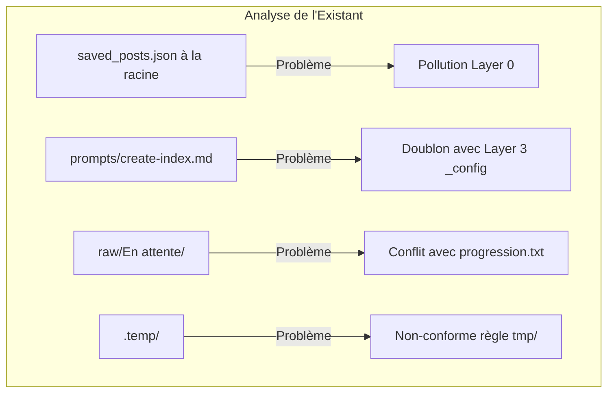

# Rapport d'Audit d'Architecture & Cohérence Structurelle (ICM)

Ce rapport analyse la cohérence de la structure actuelle du projet **Reels Vault** au regard des principes de l'**Interpretable Context Methodology (ICM / Model Workspace Protocol - arXiv:2603.16021)**.

L'objectif est d'identifier les incohérences issues du montage manuel initial et de proposer un plan de réorganisation sans altérer le fonctionnement du code.

---

## 1. Synthèse des Incohérences Identifiées

### 🔴 A. Pollutions et fichiers mal positionnés à la racine

| Fichier / Dossier | Emplacement Actuel | Emplacement Idéal selon ICM | Raison & Diagnostic |
|---|---|---|---|
| `saved_posts.json` / `saved_collections.json` | Racine (`/`) | `01_ingest/inputs/` ou `raw/sources/` | Ce sont des fichiers d'entrée spécifiques au **Stage 01**. Les garder à la racine encombre le niveau global. |
| `journal.json` | Racine (`/`) | `01_ingest/output/` ou `01_ingest/journal.json` | Journal de suivi utilisé exclusivement par `ingest.py` (Stage 01) pour éviter les doublons d'ingestion. |
| `prompts/create-index.md` | `prompts/` | Intégré dans `02_indexing/CONTEXT.md` et `_config/indexing_rules.md` | Redondance : le prompt d'indexation manuel d'origine fait désormais partie des règles Layer 3 / Stage 02. |
| `.temp/` | Racine (`.temp/`) | Consolidé dans `tmp/` | Règle globale du projet : tous les fichiers temporaires doivent résider dans `tmp/` et être préfixés par `tmp*`. |

---

### 🟡 B. Structure interne du dossier `raw/` (Conflit de suivi)

Actuellement, le dossier `raw/` contient deux sous-dossiers :
- `raw/En attente/` (contient 563 fiches Markdown)
- `raw/Traite/` (dossier vide)

**Incohérence** : 
Cette sous-division manuelle `En attente` / `Traite` entre en conflit direct avec le mécanisme automatique d'ICM qui s'appuie sur `progression.txt` (Stage 02) et `journal.json` (Stage 01). 
- `ingest.py` écrit directement dans `raw/`.
- Déplacer manuellement les fichiers entre `En attente` et `Traite` peut casser les chemins relatifs consultés par `graphe.py` et la lecture par lots du Stage 02.

**Recommandation** : Aplatir `raw/` pour que toutes les fiches soient au premier niveau de `raw/*.md` et laisser `progression.txt` gérer le statut d'avancement de manière automatisée.

---

### 🟢 C. Positionnement des Scripts (`ingest.py` et `graphe.py`)

- Actuellement, `ingest.py` et `graphe.py` sont à la racine du projet.
- **Analyse** : Dans ICM, les scripts utilitaires locaux (moteurs déterministes) peuvent rester à la racine s'ils sont partagés ou appelés directement depuis la CLI, mais chaque étape (`01_ingest/CONTEXT.md` et `04_graph/CONTEXT.md`) doit les référencer de manière explicite dans sa table `Inputs` / `Process`.
- **Statut** : Acceptable à la racine, mais leur rôle doit être strictement documenté dans leur Stage d'appartenance.

---

### 🔵 D. Cohérence des Niveaux de Contexte (Layers 0 à 4)



---

## 2. Recommandations de Réorganisation (Proposition de Plan)

Pour rendre la structure 100 % cohérente sans casser les commandes existantes, voici le plan d'assainissement proposé :

1. **Déplacer les données sources d'ingestion** :
   - Regrouper `saved_posts.json` et `saved_collections.json` dans un dossier dédié au Stage 01 : `01_ingest/inputs/` (avec liens symboliques ou mise à jour douce des chemins dans `CONTEXT.md`).
2. **Nettoyer les dossiers obsolètes** :
   - Supprimer le dossier `prompts/` inutilisé (ses consignes sont déjà dans `_config/indexing_rules.md`).
   - Supprimer `.temp/` au profit de `tmp/`.
3. **Aplatir le dossier `raw/`** :
   - Déplacer le contenu de `raw/En attente/*.md` directement dans `raw/` et supprimer les sous-dossiers `En attente/` et `Traite/`.
4. **Clarifier la place des sorties dérivées** :
   - Conserver `index.md` et `vault.html` à la racine pour la facilité d'accès utilisateur, tout en maintenant leurs versions compilées/archivées dans `02_indexing/output/` et `03_viewer/output/`.
5. **Vérification et mise à jour des documents de contexte (Tous Niveaux)** :
   - Procéder à une révision globale de tous les fichiers de contexte (Layer 0 `GLOBAL_IDENTITY.md`, Layer 1 `ROUTING.md`, Layer 2 `0X_stage/CONTEXT.md`, Layer 3 `_config/indexing_rules.md`, et `.agents/docs/*`) pour s'assurer que l'ensemble des liens, chemins de fichiers et instructions reflètent précisément la structure assainie.

---

## 3. Matrice de Cohérence Cible

```
vault/
├── GLOBAL_IDENTITY.md        # Layer 0 : Identité globale
├── ROUTING.md                # Layer 1 : Routage des requêtes
├── AGENTS.md                 # Protocole d'exécution agent
├── README.md                 # Guide du projet (avec section ICM à la fin)
├── ingest.py                 # Moteur local Ingestion (Stage 01)
├── graphe.py                 # Moteur local Obsidian (Stage 04)
├── index.md                  # Index principal (Layer 4 / Stage 02)
├── vault.html                # Viewer HTML autonome (Stage 03)
├── _config/                  # Layer 3 : Règles permanentes
│   └── indexing_rules.md
├── .agents/docs/             # Documentation du projet (Règle globale)
│   ├── ICM_ARCHITECTURE.md
│   ├── USER_FLOW.md
│   ├── FILE_LIFECYCLE.md
│   ├── AGENTS_PROTOCOL.md
│   └── AUDIT_REPORT.md
├── 01_ingest/                # Stage 01
│   ├── CONTEXT.md
│   ├── inputs/               # saved_posts.json, saved_collections.json, inbox.txt
│   └── output/               # journal.json, log d'ingestion
├── 02_indexing/              # Stage 02
│   ├── CONTEXT.md
│   └── output/               # progression.txt, sauvegarde index.md
├── 03_viewer/                # Stage 03
│   ├── CONTEXT.md
│   └── output/               # sauvegarde vault.html
├── 04_graph/                 # Stage 04
│   ├── CONTEXT.md
│   └── output/               # thèmes générés
├── raw/                      # Fiches Markdown brutes (plat)
├── images/                   # Captures extraites
└── tmp/                      # Fichiers temporaires (Règle globale)
```
