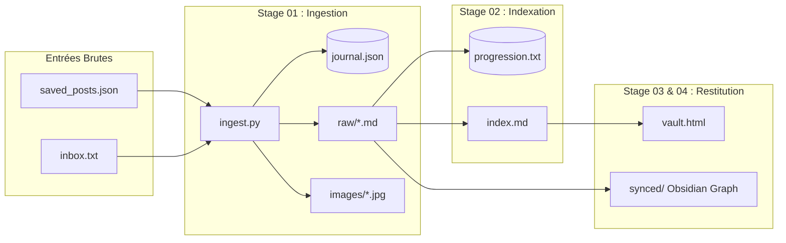

# Documentation : Cycle de Vie des Fichiers & Modèle de Données (ICM)

Ce document formalise le **cycle de vie des fichiers (File Lifecycle)** et le **modèle de persistance** du système **Reels Vault**, conformément à l'architecture **Interpretable Context Methodology (ICM / Model Workspace Protocol - arXiv:2603.16021)**.

---

## 1. Schéma Global du Flux de Données

$$\text{Source (JSON/inbox.txt)} \xrightarrow{\text{Stage 01}} \text{Fiches } \texttt{raw/*.md} \xrightarrow[\text{append}]{\text{Stage 02}} \texttt{index.md} \xrightarrow[\text{écrasement}]{\text{Stage 03}} \texttt{vault.html}$$

---

## 2. Classification & Cycles de Vie par Fichier

### A. Fichiers Source & d'Entrée
* **`saved_posts.json` / `saved_collections.json`**
  * **Layer** : Layer 4 (Working Input)
  * **Mode de mutation** : Immuable (Lecture seule).
  * **Cycle de vie** : Déposé lors de l'initialisation. Sert de source pour `ingest.py`. Persistant.
* **`inbox.txt` (Raccourci Mobile)**
  * **Layer** : Layer 4 (Working Input)
  * **Mode de mutation** : Ajout à la suite (*Append*).
  * **Cycle de vie** : Alimenté en continu depuis smartphone (iOS/Android). Traité par `ingest.py` lors du run quotidien de 18h.

### B. Artefacts d'Ingestion (Stage 01)
* **`raw/<id_post>.md` (Fiches brutes)**
  * **Layer** : Layer 4 (Working Output -> Input downstream)
  * **Mode de mutation** : Immuable après génération (sauf édition manuelle lors d'une porte de révision).
  * **Cycle de vie** : Généré par `ingest.py` avec transcriptions et métadonnées. Lu par Stage 02 et Stage 04. Stockage permanent.
* **`journal.json`**
  * **Layer** : Layer 4 (State Journal)
  * **Mode de mutation** : Mise à jour incrémentale (*Update/Append*).
  * **Cycle de vie** : Maintient le registre des URLs déjà ingérées pour garantir qu'aucune vidéo ne soit traitée deux fois.
* **`images/<id_post>_*.jpg`**
  * **Layer** : Layer 4 (Assets)
  * **Mode de mutation** : Statique.
  * **Cycle de vie** : Captures d'images extraites des vidéos. Persistant.

### C. Fichiers d'Indexation & Suivi (Stage 02)
* **`progression.txt`**
  * **Layer** : Layer 4 (Execution State)
  * **Mode de mutation** : Réécriture de l'état (*Overwrite state*).
  * **Cycle de vie** : Conserve le nom du dernier fichier `raw/*.md` indexé par lot de 25. Permet la reprise incrémentale en cas d'interruption.
* **`index.md` (Index synthétique principal)**
  * **Layer** : Layer 4 (Core Working Artifact / Review Surface)
  * **Mode de mutation** : **Ajout cumulatif à la suite (*Append*)** + Édition manuelle.
  * **Cycle de vie** : Fichier vivant. Enrichi après chaque lot de 25 fiches par le Stage 02. Sert de surface d'édition privilégiée et de source pour Stage 03 et requêtes LLM.

### D. Fichiers de Restitution & Consultation (Stage 03 & 04)
* **`vault.html` (Moteur de recherche autonome)**
  * **Layer** : Layer 4 (Derived Product)
  * **Mode de mutation** : **Régénération intégrale (*Overwrite*)**.
  * **Cycle de vie** : Recompilé par le Stage 03 à partir du contenu actuel de `index.md`. Produit final pour consultation hors-ligne (0 token).
* **`synced/` & Notes thématiques Obsidian**
  * **Layer** : Layer 4 (Derived Graph Nodes)
  * **Mode de mutation** : Mise à jour par script (`graphe.py`).
  * **Cycle de vie** : Injection de wikilinks `[[Thème]]` et génération de la structure réseau pour la vue graphe Obsidian.

### E. Configuration & Directives Usine (Layer 0 à 3)
* **`GLOBAL_IDENTITY.md`**, **`ROUTING.md`**, **`AGENTS.md`**, **`0X_stage/CONTEXT.md`**, **`_config/indexing_rules.md`**
  * **Layer** : Layer 0, 1, 2, 3 (Factory & Reference Rules)
  * **Mode de mutation** : Statiques.
  * **Cycle de vie** : Définis une fois lors du setup. Ne changent que sur décision de modification des règles métier de l'usine par l'utilisateur.

---

## 3. Matrice Recapitulative des Mutations

| Fichier / Artefact | Stage Producteur | Mode de Mutation | Persistance | Edit Surface (Révisable) |
|---|---|---|---|---|
| `saved_posts.json` | Externe | Lecture seule | Permanente | Non |
| `inbox.txt` | Smartphone | Append | Purgeable / Continu | Oui |
| `journal.json` | Stage 01 | Update / Append | Permanente | Non |
| `raw/*.md` | Stage 01 | Création unique | Permanente | Oui (Correction transcription) |
| `progression.txt` | Stage 02 | Overwrite | Permanent | Non |
| `index.md` | Stage 02 | **Append** | **Permanente & Vivante** | **Oui (Édition privilégiée)** |
| `vault.html` | Stage 03 | **Overwrite** | Régénéré | Non (Modifier `index.md` plutôt) |
| `synced/` (Obsidian) | Stage 04 | Update | Régénéré | Oui |
