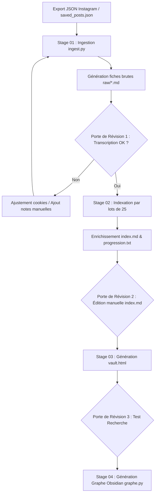
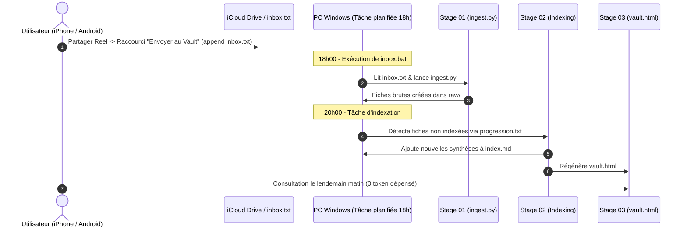

# Documentation : User Flow du Reels Vault (Architecture ICM)

Ce document décrit en détail les **parcours utilisateurs (User Flows)** du système **Reels Vault**, de l'installation initiale à la recherche quotidienne, en intégrant les principes de l'architecture **ICM (Interpretable Context Methodology - arXiv:2603.16021)**.

---

## Vue d'ensemble des Parcours

Le système repose sur 3 parcours principaux :
1. **User Flow 1 : Setup Initial & Indexation de Masse** (Premier lancement de l'archive).
2. **User Flow 2 : Ingestion Quotidienne en Arrière-Plan** (Envoi depuis smartphone via Raccourcis iOS/Android).
3. **User Flow 3 : Recherche & Interrogation** (Hors-ligne via `vault.html` ou conversationnelle via LLM).

---

## 1. User Flow 1 : Setup Initial & Indexation de Masse

Ce parcours est exécuté lors de la première configuration ou pour traiter un grand volume d'historique (ex: export JSON Instagram).



### Étapes détaillées :
1. **Étape 1 : Export des données**
   - L'utilisateur télécharge ses informations Instagram au format JSON (`saved_posts.json` et `saved_collections.json`).
   - L'utilisateur vérifie que Firefox est connecté à Instagram.

2. **Étape 2 : Stage 01 (`01_ingest`) - Récolte & Transcription**
   - L'utilisateur exécute un test sur 10 vidéos :
     ```powershell
     python ingest.py "saved_posts.json" --vault . --cookies firefox --limite 10
     ```
   - **Porte de Révision 1** : Inspection des 10 fiches générées dans `raw/`.
     - *Si la transcription Whisper est riche* -> Validation et relance complète sans `--limite`.
     - *Si la vidéo est sans voix-off* -> Marquage pour lecture d'images par LLM ou note manuelle.

3. **Étape 3 : Stage 02 (`02_indexing`) - Résumé par lots & Thématiques**
   - L'agent lit `raw/` par lots de 25 fiches et `progression.txt`.
   - L'agent résume de façon factuelle (lieux, prix, adresses) et attribue 1 à 3 thèmes selon `_config/indexing_rules.md`.
   - L'agent ajoute les entrées à la fin de `index.md`.
   - **Porte de Révision 2** : L'utilisateur peut repasser sur `index.md` pour ajuster un thème ou corriger une adresse directement dans le fichier Markdown.

4. **Étape 4 : Stage 03 (`03_viewer`) - Compilation du Dashboard**
   - L'agent ou l'utilisateur génère la page `vault.html` autonome.
   - **Porte de Révision 3** : L'utilisateur ouvre `vault.html` dans un navigateur et teste les filtres instantanés.

5. **Étape 5 : Stage 04 (`04_graph`) - Carte Thématique (Optionnel)**
   - Exécution de `python graphe.py --vault .` pour lier les notes dans Obsidian (`[[Thème]]`).

---

## 2. User Flow 2 : Ingestion Quotidienne en Arrière-Plan

Ce parcours permet à l'utilisateur de sauvegarder des Reels depuis son téléphone pendant la journée, avec traitement automatique la nuit.



### Détail de l'expérience utilisateur :
1. **Sur le téléphone** :
   - En visionnant un Reel sur Instagram ou TikTok, l'utilisateur clique sur *Partager* -> *Envoyer au Vault*.
   - Le lien est immédiatement ajouté au fichier `inbox.txt`.
2. **Côté PC (Automatisation)** :
   - À 18h, la tâche planifiée exécute `inbox.bat`. Les vidéos de `inbox.txt` sont téléchargées et transcrites dans `raw/`.
   - À 20h, l'agent repère les nouvelles fiches dans `raw/`, enrichit `index.md` et régénère `vault.html`.
3. **Le lendemain matin** :
   - L'utilisateur dispose de son index et de sa page `vault.html` mis à jour sans avoir ouvert de terminal.

---

## 3. User Flow 3 : Consultation & Interrogation

L'utilisateur dispose de deux modes complémentaires pour consulter ses données.

### Mode A : Consultation Rapide Hors-Ligne (`vault.html`)
- **Action** : Double-clic sur `vault.html` (PC ou mobile).
- **Fonctionnalités** :
  - Barre de recherche textuelle instantanée (filtre sur les lieux, auteurs, contenus).
  - Boutons de filtres par thèmes avec décompte.
  - Accès direct aux liens originaux des posts.
- **Coût & Quota** : **0 € / 0 Token**.

### Mode B : Requête Complexe par IA (Langage Naturel)
- **Action** : Pose d'une question dans la session IA (ex: *"Je pars 5 jours à Tokyo, prépare-moi un programme sur mesure avec mes Reels enregistrés"*).
- **Comportement de l'Agent (Protocole `AGENTS.md`)** :
  1. Lit en priorité `index.md` (format synthétique).
  2. N'ouvre les fiches complètes de `raw/` que si des précisions supplémentaires sont nécessaires.
  3. Construit la réponse en citant uniquement les sources réelles du Vault.
  4. Indique si une information demandée est absente du Vault au lieu d'inventer.

---

## 4. Synthèse des Portes de Contrôle Humain (Human Review Gates)

Conformément à l'article arXiv:2603.16021, l'utilisateur garde le contrôle total à chaque étape grâce à des fichiers lisibles et éditables :

| Étape / Stage | Fichier Révisable | Action Possible par l'Utilisateur |
|---|---|---|
| **Stage 01** | `raw/*.md` | Vérifier/corriger la transcription brute, ajouter des notes manuelles |
| **Stage 02** | `index.md` | Corriger une synthèse, harmoniser un nom de thème, supprimer un doublon |
| **Stage 03** | `vault.html` | Vérifier l'affichage et l'exactitude des filtres |
| **Stage 04** | Obsidian Graph | Ajuster les forces d'attraction/répulsion et les couleurs de nœuds |
